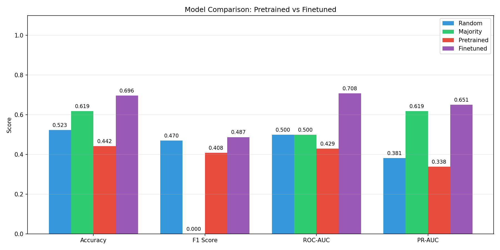

# Drug Discovery Model - ChemBERTa Finetuned

[](https://huggingface.co/Prashantkadasi/drug-discovery-chemberta)
[](https://python.org)
[](https://pytorch.org)
[](LICENSE)

A complete toolkit for **full finetuning** ChemBERTa for drug discovery on consumer GPUs (RTX 3050 6GB).

## 🎯 Results

| Metric | Pretrained | Finetuned | Improvement |
|--------|------------|-----------|-------------|
| **Accuracy** | 44.2% | **69.6%** | +57.5% |
| **F1 Score** | 40.8% | **48.8%** | +19.4% |
| **ROC-AUC** | 42.9% | **70.8%** | +64.9% |
| **PR-AUC** | 33.8% | **65.1%** | +92.5% |



## 🔬 Features

- **Full Model Finetuning** - Not LoRA, trains all 44M parameters
- **Memory Optimized** - Runs on 6GB VRAM with gradient checkpointing + FP16
- **Comprehensive Datasets** - ChEMBL, DrugBank, FDA approved/failed drugs
- **Benchmark Suite** - Compare pretrained vs finetuned performance

## 📦 Installation

```bash
git clone https://github.com/YOUR_USERNAME/drug-discovery-chemberta.git
cd drug-discovery-chemberta
pip install -r requirements.txt
```

## 🚀 Quick Start

### 1. Download Datasets
```bash
python scripts/download_all.py
```
Downloads from ChEMBL, DrugBank, FDA APIs + curated failed drugs list.

### 2. Train Model
```bash
python train.py --epochs 10
```

### 3. Evaluate & Benchmark
```bash
python evaluate.py
python benchmark.py --generate_report
```

## 🤗 Using the Pretrained Model

```python
from transformers import AutoTokenizer, AutoModelForSequenceClassification
import torch

# Load from Hugging Face
tokenizer = AutoTokenizer.from_pretrained("Prashantkadasi/drug-discovery-chemberta")
model = AutoModelForSequenceClassification.from_pretrained("Prashantkadasi/drug-discovery-chemberta")

# Predict for Aspirin
smiles = "CC(=O)OC1=CC=CC=C1C(=O)O"
inputs = tokenizer(smiles, return_tensors="pt", padding=True, truncation=True, max_length=128)

with torch.no_grad():
    outputs = model(**inputs)
    probs = torch.softmax(outputs.logits, dim=-1)
    prediction = "Approved" if probs[0][1] > 0.5 else "Failed"
    confidence = probs[0][1].item() if prediction == "Approved" else probs[0][0].item()

print(f"Prediction: {prediction} (confidence: {confidence:.2%})")
```

## 📁 Project Structure

```
drug-discovery-chemberta/
├── config.py              # Training configuration
├── train.py               # Main training script
├── evaluate.py            # Evaluation with metrics
├── benchmark.py           # Pretrained vs finetuned comparison
├── upload_to_hf.py        # Hugging Face upload script
├── scripts/
│   ├── download_chembl.py     # ChEMBL dataset downloader
│   ├── download_drugbank.py   # DrugBank/PubChem downloader
│   ├── download_fda.py        # FDA drugs + failed drugs
│   ├── prepare_dataset.py     # Combine & split data
│   └── download_all.py        # Master downloader
├── src/
│   ├── dataset.py         # PyTorch Dataset for SMILES
│   ├── model.py           # ChemBERTa with gradient checkpointing
│   └── trainer.py         # Training utilities
├── results/               # Benchmark results and plots
└── data/                  # Downloaded datasets
```

## 💾 Memory Optimization

Fits in 6GB VRAM using:
- **Gradient Checkpointing** - Saves ~40% memory
- **Mixed Precision (FP16)** - Saves ~50% memory
- **Small Batch Size** - 8 with gradient accumulation

## 📊 Datasets

| Category | Source | Description |
|----------|--------|-------------|
| **Approved Drugs** | ChEMBL, DrugBank, FDA | FDA/EMA approved medicines |
| **Failed Drugs** | DrugBank, FDA | Withdrawn, clinical trial failures |
| **Novel Alternatives** | ChEMBL | Experimental compounds |

## 📄 License

MIT License

## 🙏 Acknowledgments

- [ChemBERTa](https://huggingface.co/seyonec/ChemBERTa-zinc-base-v1) - Base model
- [ChEMBL](https://www.ebi.ac.uk/chembl/) - Bioactivity database
- [DrugBank](https://go.drugbank.com/) - Drug database
- [OpenFDA](https://open.fda.gov/) - FDA drug data
